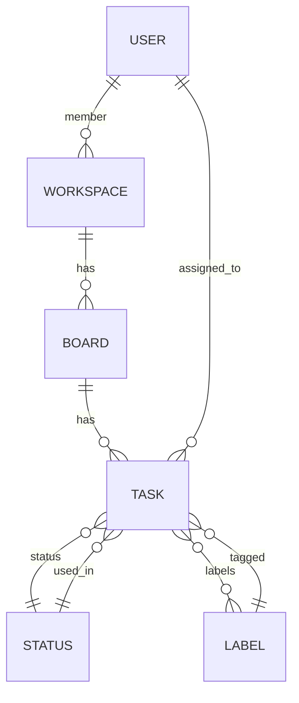

# 📝 Task Management Platform

<div align="center" style="font-size:1.3em; line-height:2.2; margin-bottom: 32px;">
  <b>A Trello-like Team Collaboration & Task Management Platform built with Django</b>
</div>

<div align="center" style="margin-bottom: 32px;">
  
  
  
</div>

---

## 🎨 Demo Screenshots

<div align="center" style="margin-bottom: 32px;">
  
  
  <br/>
  <i>Sample views of the platform</i>
</div>

---

## ✨ Features

<ul style="line-height:2.2; font-size:1.1em; margin-bottom: 32px;">
  <li>🧑‍💼 <b>Workspace:</b> Create and manage workspaces with multi-user support and role assignment (member, admin, etc.)</li>
  <li>🗂️ <b>Board:</b> Create multiple boards per workspace to organize tasks</li>
  <li>📝 <b>Task:</b> Create, edit, and assign tasks to members with status, labels, and due dates</li>
  <li>📊 <b>Reports:</b> View daily and monthly progress reports</li>
  <li>🔑 <b>Authentication:</b> User registration, login, and logout</li>
  <li>🌐 <b>Web UI:</b> Responsive HTML pages with Bootstrap for easy management</li>
  <li>🛠️ <b>API:</b> Manage boards, tasks, statuses, and labels via API (only <code>board_admin</code> group members have full access)</li>
  <li>📄 <b>Swagger Docs:</b> API documentation with drf-yasg, available at <code>/swagger/</code></li>
</ul>

---

## 🗂️ Project Structure

```css
trello/
├── <span style="color:#0074D9;">boards/</span>                # 🗂️ Board & Task management app
├── <span style="color:#0074D9;">hello/</span>                 # 💬 Messaging, workspace, and user management app
├── <span style="color:#0074D9;">web_django/</span>            # ⚙️ Django project settings
├── <span style="color:#0074D9;">manage.py</span>              # 🛠️ Django management script
├── <span style="color:#0074D9;">requirements.txt</span>       # 📦 Project dependencies
├── <span style="color:#0074D9;">Dockerfile</span>             # 🐳 Dockerfile for running the project
├── <span style="color:#0074D9;">docker-compose.yml</span>     # 🐳 Docker Compose for project & database
└── <span style="color:#0074D9;">README.md</span>              # 📄 This file
```

---

## ⚙️ Installation & Setup

### Prerequisites

- 🐍 Python 3.11+
- 🐘 PostgreSQL
- 📦 [pip](https://pip.pypa.io/en/stable/)
- 🐳 (Optional) Docker & Docker Compose

### Setup Steps

<ol style="line-height:2.2; font-size:1.1em; margin-bottom: 32px;">
  <li><b>Clone the repository:</b>
    <pre><code>git clone &lt;repo-url&gt;
cd trello
</code></pre>
  </li>
  <li><b>Create a virtual environment & install dependencies:</b>
    <pre><code>python -m venv .venv
.venv\Scripts\activate
pip install -r requirements.txt
</code></pre>
  </li>
  <li><b>Configure the database:</b> Create a PostgreSQL database and update the credentials in <code>web_django/settings.py</code>.</li>
  <li><b>Run migrations:</b>
    <pre><code>python manage.py migrate
</code></pre>
  </li>
  <li><b>Create a superuser (optional):</b>
    <pre><code>python manage.py createsuperuser
</code></pre>
  </li>
  <li><b>Start the server:</b>
    <pre><code>python manage.py runserver
</code></pre>
  </li>
  <li><b>(Optional) Run with Docker:</b>
    <pre><code>docker-compose up --build
</code></pre>
  </li>
</ol>

---

## 🧪 Running Tests

To run project tests:
```bash
python manage.py test
```

---

## 🚪 Main Entry Points

<ul style="line-height:2.2; font-size:1.1em; margin-bottom: 32px;">
  <li>🏠 <b>Home:</b> <code>/</code></li>
  <li>🔐 <b>Login:</b> <code>/login/</code></li>
  <li>📝 <b>Register:</b> <code>/register/</code></li>
  <li>🗂️ <b>Workspace List:</b> <code>/workspaces/</code></li>
  <li>📄 <b>API Docs:</b> <code>/swagger/</code></li>
  <li>🛠️ <b>Boards API:</b> <code>/boards/api/boards/</code></li>
</ul>

---

## 🔐 Permissions & User Roles

- Only members of the <b>🛡️ board_admin</b> group can manage boards and tasks via API.
- Workspace members can view tasks and boards related to their workspace.

---

## 👨‍💻 Developers

- <span title="Alireza Rahmani Firouzja">👨‍💻 Alireza Rahmani Firouzja</span>

---

## 📄 License

This project is licensed under the MIT License.

---

## 🗺️ Model Relationship Diagram


