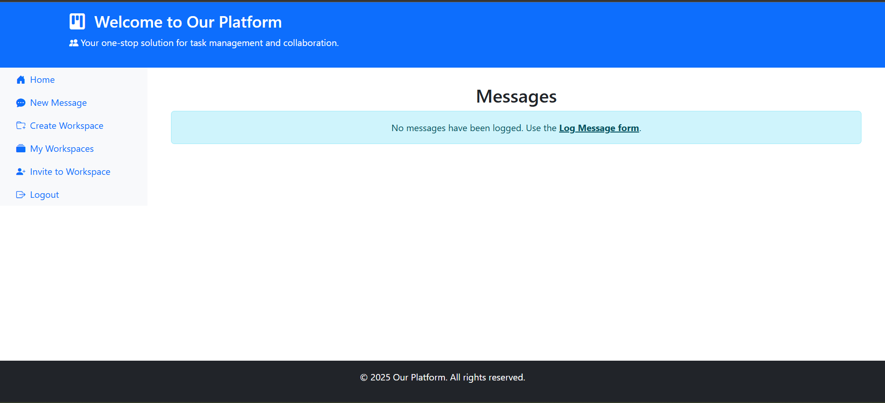
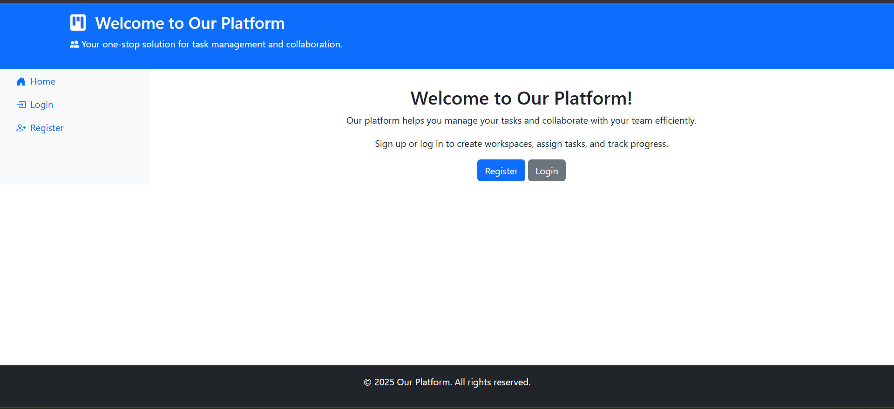
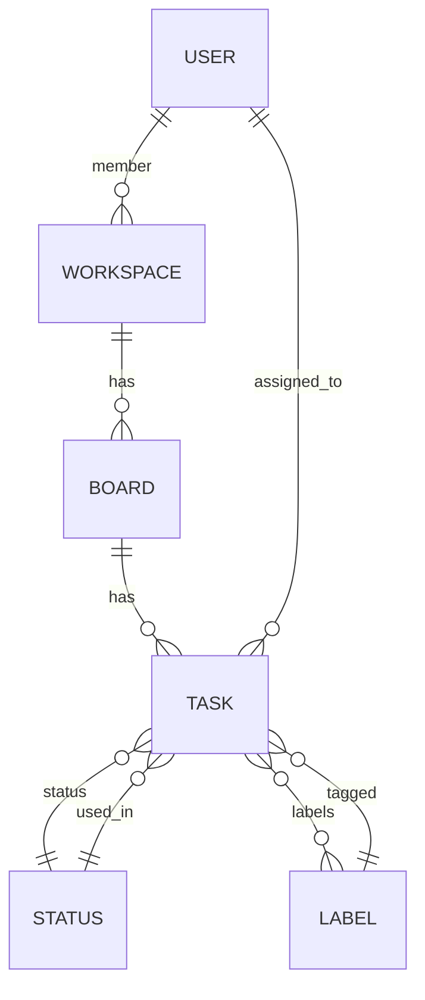

<style>
body {
  font-family: "Segoe UI", "Tahoma", "Geneva", "Verdana", "sans-serif";
  line-height: 1.8;
  font-size: 1.08em;
}
.markdown-body {
  font-family: "Segoe UI", "Tahoma", "Geneva", "Verdana", "sans-serif";
  line-height: 1.8;
  font-size: 1.08em;
}
</style>

# Task Management Platform

<div align="center">
  
  
  
</div>

---

<p align="center" dir="rtl" style="font-size:1.2em;">
  <b>پلتفرم مدیریت کارها و همکاری تیمی شبیه Trello با Django</b>
</p>

---

## 🎨 نمونه محیط پروژه

<div align="center" style="margin-bottom: 28px;">
  
  
  <br/>
  <i>نمونه‌ای از محیط پلتفرم</i>
</div>

---

## ✨ ویژگی‌ها

<ul style="line-height: 2;">
  <li>🧑‍💼 <b>ورک‌اسپیس (Workspace):</b> ایجاد و مدیریت ورک‌اسپیس‌ها با قابلیت عضویت چند کاربر و تعیین نقش (عضو، ادمین[...]
  <li>🗂️ <b>برد (Board):</b> ساخت بردهای مختلف برای هر ورک‌اسپیس جهت دسته‌بندی تسک‌ها</li>
  <li>📝 <b>تسک (Task):</b> ایجاد، ویرایش و تخصیص تسک به اعضا با وضعیت، لیبل و تاریخ‌های مختلف</li>
  <li>📊 <b>گزارش‌ها:</b> مشاهده گزارش‌های روزانه و ماهانه از انجام کارها</li>
  <li>🔑 <b>سیستم احراز هویت:</b> ثبت‌نام، ورود و خروج کاربران</li>
  <li>🌐 <b>رابط کاربری وب:</b> صفحات HTML با Bootstrap و قالب‌بندی مناسب برای مدیریت آسان‌تر</li>
  <li>🛠️ <b>API:</b> ارائه API برای مدیریت برد، تسک، وضعیت و لیبل با سطح دسترسی مناسب (فقط اعضای گروه <code>board_admin</code> مجا�[...]
  <li>📄 <b>مستندسازی Swagger:</b> مستندات API با drf-yasg و دسترسی از طریق <code>/swagger/</code></li>
</ul>

---

## 🗂️ ساختار پروژه

```css
trello/
├── <span style="color:#0074D9;">boards/</span>                # 🗂️ اپلیکیشن مدیریت برد و تسک
├── <span style="color:#0074D9;">hello/</span>                 # 💬 اپلیکیشن مدیریت پیام‌ها، ورک‌اسپیس و کاربران
├── <span style="color:#0074D9;">web_django/</span>            # ⚙️ تنظیمات پروژه Django
├── <span style="color:#0074D9;">manage.py</span>              # 🛠️ اسکریپت مدیریت Django
├── <span style="color:#0074D9;">requirements.txt</span>       # 📦 وابستگی‌های پروژه
├── <span style="color:#0074D9;">Dockerfile</span>             # 🐳 فایل داکر برای اجرای پروژه
├── <span style="color:#0074D9;">docker-compose.yml</span>     # 🐳 اجرای پروژه و دیتابیس با Docker
└── <span style="color:#0074D9;">README.md</span>              # 📄 این فایل
```

---

## ⚙️ نصب و راه‌اندازی

### پیش‌نیازها

- 🐍 Python 3.11+
- 🐘 PostgreSQL
- 📦 [pip](https://pip.pypa.io/en/stable/)
- 🐳 (اختیاری) Docker و Docker Compose

### مراحل نصب

<ol style="line-height: 2;">
  <li><b>کلون کردن مخزن:</b>
    <pre><code>git clone &lt;repo-url&gt;
cd trello
</code></pre>
  </li>
  <li><b>ساخت محیط مجازی و نصب وابستگی‌ها:</b>
    <pre><code>python -m venv .venv
.venv\Scripts\activate
pip install -r requirements.txt
</code></pre>
  </li>
  <li><b>تنظیم دیتابیس:</b> یک دیتابیس PostgreSQL بسازید و اطلاعات آن را در <code>web_django/settings.py</code> وارد کنید.</li>
  <li><b>اجرای مهاجرت‌ها:</b>
    <pre><code>python manage.py migrate
</code></pre>
  </li>
  <li><b>ساخت ابرکاربر (اختیاری):</b>
    <pre><code>python manage.py createsuperuser
</code></pre>
  </li>
  <li><b>اجرای سرور:</b>
    <pre><code>python manage.py runserver
</code></pre>
  </li>
  <li><b>(اختیاری) اجرای پروژه با Docker:</b>
    <pre><code>docker-compose up --build
</code></pre>
  </li>
</ol>

---

## 🧪 اجرای تست‌ها

برای اجرای تست‌های پروژه:
```bash
python manage.py test
```

---

## 🚪 نقاط ورود مهم

<ul style="line-height: 2;">
  <li>🏠 <b>صفحه اصلی:</b> <code>/</code></li>
  <li>🔐 <b>ورود:</b> <code>/login/</code></li>
  <li>📝 <b>ثبت‌نام:</b> <code>/register/</code></li>
  <li>🗂️ <b>لیست ورک‌اسپیس‌ها:</b> <code>/workspaces/</code></li>
  <li>📄 <b>مستندات API:</b> <code>/swagger/</code></li>
  <li>🛠️ <b>API بردها:</b> <code>/boards/api/boards/</code></li>
</ul>

---

## 🔐 دسترسی‌ها و سطوح کاربری

- فقط اعضای گروه <b>🛡️ board_admin</b> می‌توانند برد و تسک را از طریق API مدیریت کنند.
- اعضای ورک‌اسپیس می‌توانند تسک‌ها و بردهای مربوط به ورک‌اسپیس خود را مشاهده کنند.

---

## 👨‍💻 توسعه‌دهندگان

- <span title="Alireza Rahmani Firouzja">👨‍💻 Alireza Rahmani Firouzja</span>

---

## 📄 لایسنس

این پروژه تحت لایسنس MIT ارائه می‌شود.

---

## 🗺️ دیاگرام ارتباطی مدل‌ها


